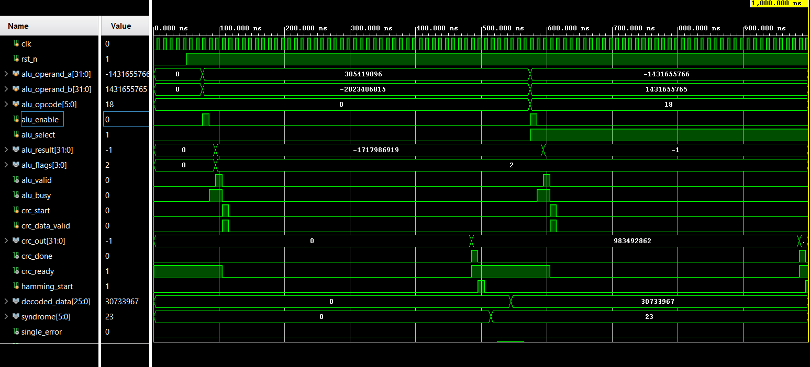
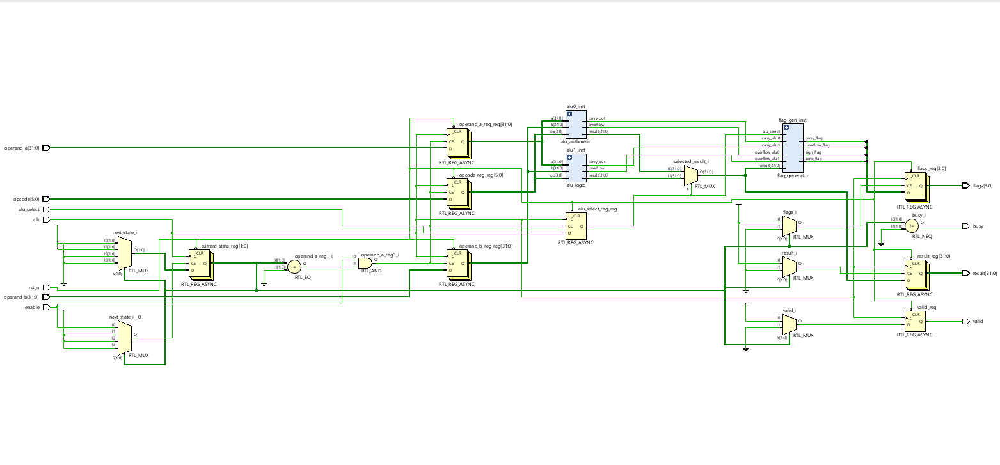

# parallel-alu-flag-crc32-hamming
Parallel ALU Bank with Full-Width Arithmetic/Logic Execution, Flag Computation, CRC32 Generation, and Hamming(32,26) Error Correction — Verilog HDL Implementation on FPGA

  

  

